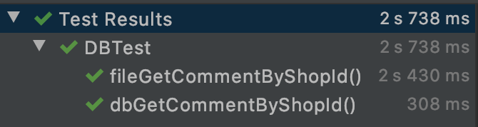

# CS307 Project 1 Compare DBMS and fileIO

## Introduction

To prove DBMS is better than direct file IO. Using this experiment to bench these two method.

## Experimental design

### Experimental data and environments

- Data: real data from dianping.com
- Environments:
    - OS: macOS Catalina 10.15.3
    - Hardware: Intel Core i5 2.7 GHz, 8 GB 1867 MHz DDR3
    - Language: Java
        - Maven
        - Junit
        - Postgresql JDBC
        - OpenCSV
    - Database: Postgresql 12.1

### Experiments

Get random row from dataset, comparing the time.

FileIO method reads data a pre-indexed csv file 
using Java String Stream method to skip for lines
without read it into memory to support large file.

Using pre-indexed file is for the core acceleration of fileIO using binary search.
```Java
public Comment getCommentByShopID(int shopId) throws IOException {
    Stream<String> lines = Files.lines(Paths.get("res/comment.csv"));
    long cnt = lines.count();
    long left = 0;
    long right = cnt;
    while (left < right) {
        long skip = (left + right) / 2;
        lines = Files.lines(Paths.get("res/comment.csv"));
        String line = lines.skip(skip).findFirst().get();
        Comment comment = loadComment(line);

        if (comment.getShop_id() > shopId) {
            right = skip;
        } else if (comment.getShop_id() < shopId) {
            left = skip;
        } else {
            return comment;
        }
    }
    return null;
}
```


The table in postgresql database is defined with following DDL:
```SQL
create table comment
(
	id serial not null
		constraint comments_pk
			primary key,
	user_id varchar,
	rank integer default 0 not null,
	content text not null,
	shop_id integer
		constraint comments_shop_cache_id_fk
			references shop
				on update cascade on delete cascade
);

create index comment_shop_id_index
	on comment (shop_id);
```
and query with following SQL:
```SQL
SELECT * FROM comment WHERE shop_id = ? LIMIT 1
```

Then the JUnit5 test is give as following:
```Java
public class DBTest {

    @Test
    void fileGetCommentByShopId() {
        FileIODataSource fileIODataSource = new FileIODataSource("./res");

        try {
            Comment comment = fileIODataSource.getCommentByShopID(119);
            System.out.printf("Comment:%d %d\n", comment.getId(), comment.getShop_id());
        } catch (IOException e) {
            e.printStackTrace();
        }
    }

    @Test
    void dbGetCommentByShopId() {
        PostgreSQLDataSource postgreSQLDataSource = new PostgreSQLDataSource();
        try {
            Comment comment = postgreSQLDataSource.getCommentByShopID(119);
            System.out.printf("Comment:%d %d\n", comment.getId(), comment.getShop_id());
        } catch (SQLException e) {
            e.printStackTrace();
        }
    }
}
```

### Experimental results

The average time of fileIO method is over 2s while the psql gives the maxium time of 350ms.



## Conclusions

DBMS make it easy to manage large scale dataset, and accelerate access time using methods like index and b-tree.

This experiments did not include the updating of the file because the result is obvious.
In this design of fileIO, the program need to write back whole file after the insert operation which can cause many problem when the scale of the dataset is large.

Although adding cache and other method to fileIO can improve the proformance, this has no difference between creating a new DBMS on you own which is complex and unmaintainable.

Thus we should use a properate DBMS when dealing with data.